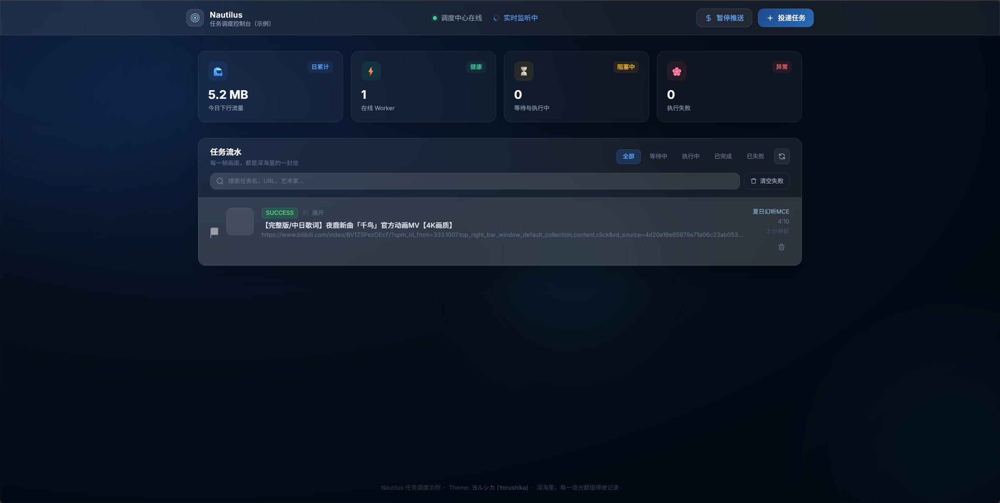
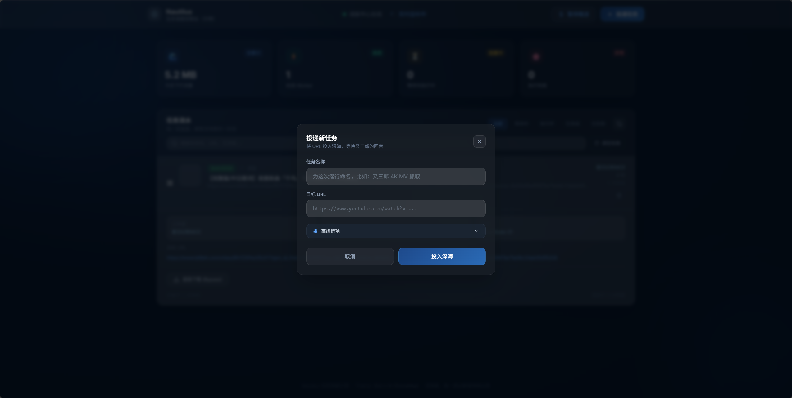
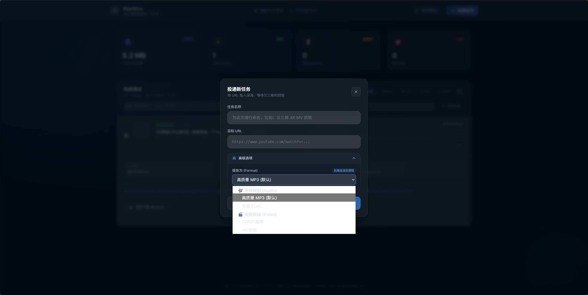
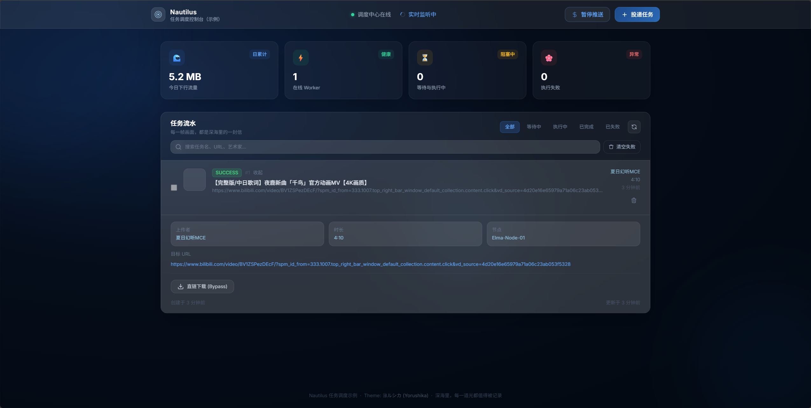

# Nautilus · 基于 PostgreSQL SKIP LOCKED 的 Pull 型异步任务调度项目

个人求职用仓库：**PostgreSQL 存任务行，多 Worker 主动拉取并执行，HTTP 回写状态**。Java（Spring Boot）为唯一连库的控制面；Python Worker 只调 API；`nautilus-frontend` 为 Vue 3 CDN 静态控制台。示例负载为 URL + yt-dlp 下载，**不是**网盘、对象存储或分发平台。

## 项目解决的问题

- 不用消息中间件时，如何用**表行**表达队列，并让多 Worker **抢不同行**（`SKIP LOCKED`），避免应用层粗粒度锁。  
- 如何落地简单**状态机**（`PENDING` → `RUNNING` → `SUCCESS` / `FAILED`）、**有限次重试**与 **RUNNING 超时回收**。  
- **控制面 / 执行面分离**：Java 持久化与对外 API；Python 不直连数据库。

## 核心流程

1. 插入 `sys_media_task`，`PENDING`（可按 `next_retry_at` 排序）。  
2. Worker：`GET /api/v1/tasks/pending?workerNode=...` → `pullPendingTask` 在**同一事务**内：`selectOnePendingForUpdate`（`FOR UPDATE SKIP LOCKED`）→ `updateTaskToRunning`；无任务则 `AjaxResult.noContent`（如 HTTP 204）。  
3. Worker 执行（如 yt-dlp）→ `PUT /api/v1/tasks/{taskId}/status`；失败走 `handleFailureWithRetry`（`retry_count` / `max_retry` / `next_retry_at`）。  
4. `TaskMaintenanceScheduler` 按 `task.reclaim-interval-ms` 调用 `reclaimTimedOutRunningTasks`，配合 `selectTimedOutRunningForUpdate` 与 `task.running-timeout-seconds`。

## 关键工程点

| 主题 | 位置（对照代码） |
|------|------------------|
| Pull + `SKIP LOCKED` | `SysMediaTaskMapper.xml`：`selectOnePendingForUpdate`、`updateTaskToRunning`、超时 `selectTimedOutRunningForUpdate`；`SysMediaTaskServiceImpl.pullPendingTask`（`@Transactional`）。 |
| 状态与重试 | `reportTaskStatus`、`handleFailureWithRetry`；`scheduleTaskRetry` / `markTaskFinalFailed`；`application.yml` → `task.retry.*`。 |
| 超时回收 | `TaskMaintenanceScheduler`、`reclaimTimedOutRunningTasks`。 |
| JSONB | `SysMediaTask.metaInfo` + `JacksonTypeHandler`；`schema.sql` 中间索引。 |
| 任务变更推送 | `TaskUpdateEvent` → `SseServiceImpl` → `SseEmitter`。 |
| 跨语言 | 控制面编排落库；Worker `httpx` + `asyncio.to_thread`（`elma-stream-worker/main.py`）。 |

## 架构与目录

- **前端** `nautilus-frontend/index.html`：REST + `EventSource` → `/api/v1/tasks/stream`。  
- **控制面** `amy-dispatch-center`：JDBC、任务 API、统计/健康检查、本机文件下载（见边界）。  
- **Worker** `elma-stream-worker/main.py`：仅 HTTP；`NAUTILUS_AUTH_TOKEN` 对齐 `nautilus.auth.token`。  
- **公共** `ruoyi-common`：`AjaxResult`、`ServiceException` 等。  

关系与图示：`[docs/ARCHITECTURE.md](docs/ARCHITECTURE.md)`。

```
nautilus-media-cloud/
├── docs/
│   ├── ARCHITECTURE.md
│   └── images/                    # 界面预览
├── ruoyi-common/
├── amy-dispatch-center/
├── elma-stream-worker/
├── nautilus-frontend/
├── start_media_cloud.bat / .ps1
├── API_TEST_GUIDE.md
└── test_*.ps1
```

## 项目边界与限制

- **Bearer**：`AuthInterceptor` + `nautilus.auth.token`（默认 `changeme`）。演示用，非公网方案。  
- **`/stream`、`/*/download`**：`WebMvcConfig` **排除**拦截器；SSE 未与 API 同级校验 token；下载读控制面本地 `File`，勿对不可信网络暴露。  
- **路径**：`meta_info.filePath` 与 Worker 是否同机、多 Worker 时下载模型均受限。  
- **`GET /stats`**：`listTasks(null)` 后内存聚合，仅适合**小规模**数据。  
- **语义**：接近「至少执行一次」；幂等由业务定义。  
- **在线 Worker**：`WorkerRegistry` 为**进程内**心跳，重启即丢。

## 快速启动

**库**：建库 `nautilus_dispatch`（与 JDBC 默认一致），执行 `amy-dispatch-center/src/main/resources/db/schema.sql` 与 `init-data.sql`（PowerShell 下若报编码错误，对 `psql` 使用 UTF-8 客户端或 `chcp 65001` 再试）。

**环境**：`SPRING_DATASOURCE_PASSWORD`（及按需 URL/用户）；`NAUTILUS_AUTH_TOKEN`（默认 `changeme`，对齐前端登录与 Worker）。

**端口**：后端 **8080**；静态页端口自定（示例 `python -m http.server 5173`）。

```bash
cd ruoyi-common && mvn clean install && cd ../amy-dispatch-center && mvn spring-boot:run
```

```bash
cd elma-stream-worker && pip install -r requirements.txt
# Windows: set NAUTILUS_AUTH_TOKEN=changeme  |  Linux/macOS: export NAUTILUS_AUTH_TOKEN=changeme
python main.py
```

也可根目录 `start_media_cloud.bat`（依赖本机 Maven/Java/Python/PostgreSQL 等）。

## 界面预览

本地跑通控制台后的操作路径示意（资源用 `docs/images/`）。

### 1. 控制台首页



在线 Worker、任务统计与列表。

### 2. 创建任务



任务名与目标 URL 提交至控制面。

### 3. 参数配置



格式等字段走 `meta_info`，供 Worker 读取（透传演示）。

### 4. 执行结果



状态、URL、节点与下载入口（依赖本机路径与边界说明）。

## 可讨论的技术点（面试收窄用）

- `SKIP LOCKED` 与「先 SELECT 再 UPDATE」非同事务的差别。  
- 认领为何必须 **`selectOnePendingForUpdate` + `updateTaskToRunning` 同事务**。  
- `next_retry_at` 与 `task.retry.base-delay-seconds` / `max-delay-seconds` 的退避含义。  
- RUNNING 超时与 Worker 失联的兜底。  
- JSONB + 索引在 `schema.sql` 中的取舍。  
- 数据库当队列：锁、索引、统计实现 vs 引入 MQ 的边界。  
- 为何 Worker 禁止直连 DB。  

---

MIT License · 个人学习与求职演示
